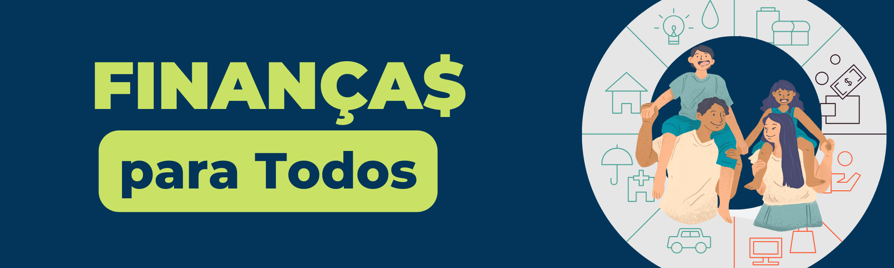

# Projeto Final - Imersão JavaScript 

### [O que é a {reprograma}?](https://reprograma.com.br/)
A {reprograma} é uma iniciativa de impacto social, fundada em 2016, e tem como missão diminuir a lacuna de gênero no setor de Tecnologia e trazer mais diversidade para a área.

### [O que é a Imersão JavaScript?](https://reprograma.com.br/curso-imersao-javascript/)

É uma iniciativa da {reprograma} desenvolvida com o objetivo de promover uma capacitação focada no aperfeiçoamento de conhecimentos técnicos em JavaScript e no desenvolvimento profissional de mulheres que estão iniciando sua carreira na área de tecnologia. Dentre os conteúdos oferecidos no curso, estão: **Pirâmide de Testes, Test Driven Development, Orientação a Objetos, Codigo Limpo, Refatoração e SOLID.**

