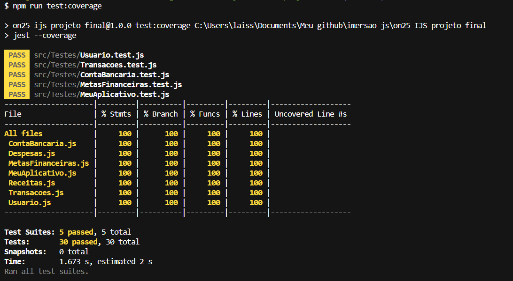

# Meu Aplicativo - FINANÇA$ para Todos

Projeto desenvolvido como trabalho de conclusão do curso Imersão JavaScript.

&nbsp;
&nbsp;
&nbsp;
&nbsp;
 

## Objetivo:

Este projeto tem como objetivo ajudar as pessoas a controlar suas despesas e receitas e a alcançar seus objetivos financeiros e metas, através de um Planejamento Financeiro Personalizado contribuindo assim para a promoção do crescimento econômico sustentável (ODS 8), e para a redução da pobreza (ODS 1).

### Aprendizados:

Foram utilizados os conceitos de:

- Orientação a Objetos - com Classes e instânciação de objetos na Linguagem JavaScript;
- Desenvolvimento Orientado a Teste;
- Princípios de SOLID;
- Clean Code.

### Tecnologias:

- JavaScript
- Jest
- Git

### Cobertura de Testes:

#### [O que é a {reprograma}?](https://reprograma.com.br/)

A {reprograma} é uma iniciativa de impacto social, fundada em 2016, e tem como missão diminuir a lacuna de gênero no setor de Tecnologia e trazer mais diversidade para a área.

#### [O que é a Imersão JavaScript?](https://reprograma.com.br/curso-imersao-javascript/)

É uma iniciativa da {reprograma} desenvolvida com o objetivo de promover uma capacitação focada no aperfeiçoamento de conhecimentos técnicos em JavaScript e no desenvolvimento profissional de mulheres que estão iniciando sua carreira na área de tecnologia. Dentre os conteúdos oferecidos no curso, estão: **Pirâmide de Testes, Test Driven Development, Orientação a Objetos, Codigo Limpo, Refatoração e SOLID.**
